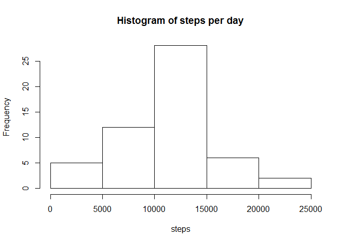
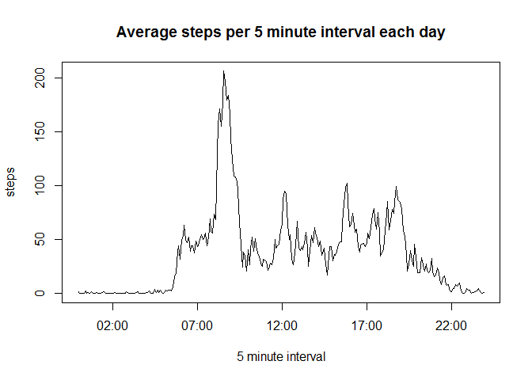

# Reproducible Research: Peer Assessment 1


## Loading and preprocessing the data
* Set handy options so that numbers are formatted nicely
* Unzip and load the activity data
* Convert dates and times to more useful formats

```r
options(scipen = 1, digits = 2)
unzip("activity.zip")
activity.data <- read.csv("activity.csv")
library(lubridate)
activity.data$date <- ymd(activity.data$date)
activity.data$interval <- parse_date_time(sprintf("%04d", activity.data$interval), "H!M!")
```


## What is mean total number of steps taken per day?
* Explore the total number of steps each day as a histogram, then calculate the mean and median steps per day

```r
data.daily <- aggregate(steps ~ date, data = activity.data, FUN = sum)
hist(data.daily$steps, main="Histogram of steps per day", xlab="steps")
```

 

```r
mean.daily.steps <- mean(data.daily$steps)
median.daily.steps <- median(data.daily$steps)
```
* The average number of steps taken per day was: 10766.19
* The median number of steps taken per day was: 10765

## What is the average daily activity pattern?
* Explore the average pattern of steps taken at the same time each day

```r
data.perinterval <- aggregate(steps ~ interval, data = activity.data, FUN = mean)
plot(data.perinterval, type="l",
     main="Average steps per 5 minute interval each day", 
     xlab="5 minute interval")
```

 

```r
max.interval <- data.perinterval$interval[which.max(data.perinterval$steps)]
```

* The 5 minute interval with the maximum average number of steps was: 08:35


## Imputing missing values


## Are there differences in activity patterns between weekdays and weekends?
