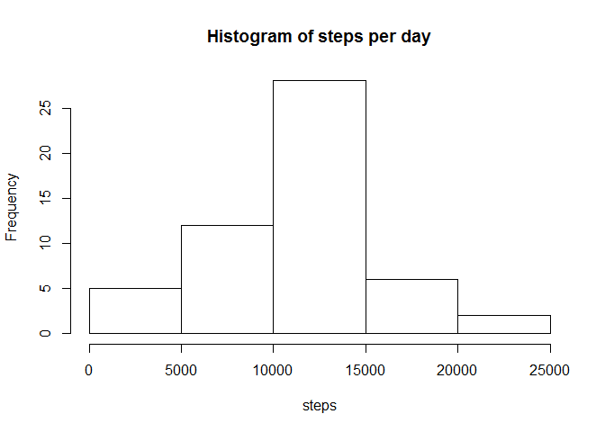

# Reproducible Research: Peer Assessment 1


## Loading and preprocessing the data
* Unzip and load the activity data
* Convert dates to a more useful format

```r
unzip("activity.zip")
activity.data <- read.csv("activity.csv")
library(lubridate)
activity.data$date <- ymd(activity.data$date)
```


## What is mean total number of steps taken per day?
* Explore the total number of steps each day as a histogram
* Calculate mean and median steps per day

```r
daily.data <- aggregate(steps ~ date, data = activity.data, FUN = sum)
hist(daily.data$steps, main="Histogram of steps per day", xlab="steps")
```

 

```r
mean(daily.data$steps)
```

```
## [1] 10766.19
```

```r
median(daily.data$steps)
```

```
## [1] 10765
```


## What is the average daily activity pattern?


## Imputing missing values


## Are there differences in activity patterns between weekdays and weekends?
